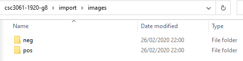
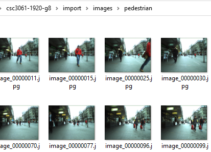

**CSC3061-1920-G8 Pedestrian Detection**

**Requires: Computer Vision Toolbox**
Getting started:
1. Clone repo to a local directory
2. Place  the **model data** (*images.zip*) in the import directory. The structure should contain both *neg* and *pos* folders e.g. *import/images/neg* and *import/images/pos*

3. Place the **pedestrian data** (*pedestrian.zip*) in the import directory. The structure should be *import/images/pedestrian*

4. From parent directory run **pd.m**

<!--stackedit_data:
eyJoaXN0b3J5IjpbLTEyMDczMDg2NTgsLTQyNzU4OTE3NiwtND
I3NTg5MTc2LDE4NDA5MzYxNzIsMTg5OTEyMDU4MiwtMTUxNzY3
NzQyOSwtNTU0MDkzNDUxLDE3NTQxMTkzODIsLTY5NDc5ODMyNS
wtNjgyMDAwOTA0XX0=
--># Pedestrian-Detection
